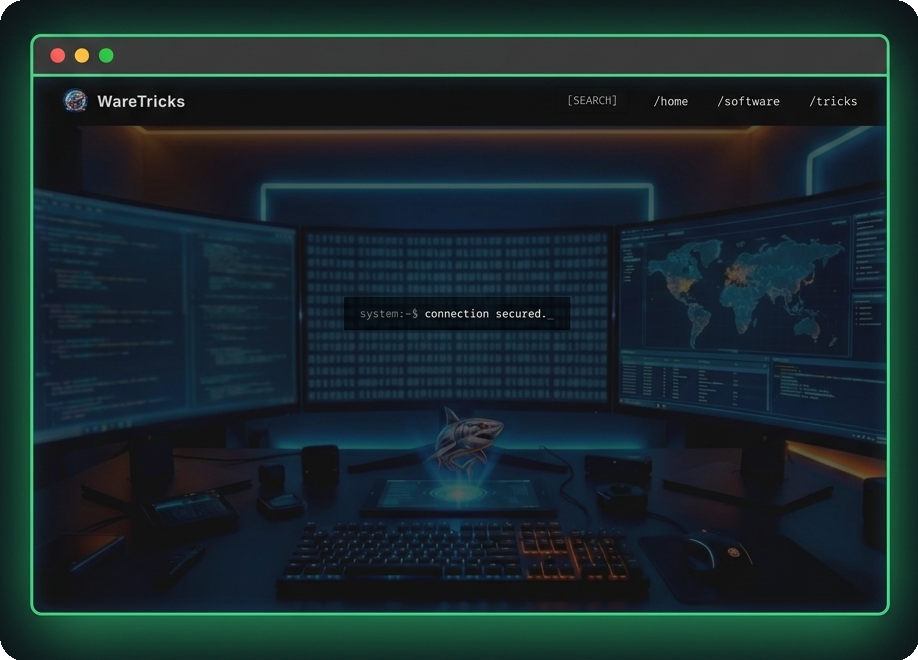

# ~$ whoami

  

---

## >_ About Me

SysAdmin by day, automation scripter by night. I keep servers, networks, and hardware running (both Linux and Windows), but my favorite part of the job is coding tools to automate the boring stuff. 

Lately, I've been writing PowerShell/Python scripts and building internal tools—like a custom IT asset management system—to cut down manual tasks. I use AI tools to speed up my coding so I can focus on building things that just work.

---

## >_ Open Source Project

  <a href="https://github.com/khairudinfahmi/WindowsPrinterSharingFix">
    <picture>
      <source media="(prefers-color-scheme: dark)" srcset="./assets/windows-printer-sharing-fix-dark.svg" />
      <source media="(prefers-color-scheme: light)" srcset="./assets/windows-printer-sharing-fix-light.svg" />
      
    </picture>
  </a>

---

## >_ IT Tools & Workarounds

  If you need essential software downloads, system utilities, or quick IT workarounds, you can visit my portal directly at <strong><a href="https://waretricks.vercel.app">WareTricks</a></strong>.

  

---

## >_ Tech Stack

  <a href="https://skillicons.dev">
    <picture>
      <source media="(prefers-color-scheme: dark)" srcset="https://skillicons.dev/icons?i=astro%2Ccss%2Cdocker%2Cgit%2Cgithub%2Chtml%2Cjs%2Claravel%2Clinux%2Cmysql%2Cnginx%2Cphp%2Cpowershell%2Cpython%2Cts%2Cvscode%2Cwindows&perline=8&theme=dark" />
      <source media="(prefers-color-scheme: light)" srcset="https://skillicons.dev/icons?i=astro%2Ccss%2Cdocker%2Cgit%2Cgithub%2Chtml%2Cjs%2Claravel%2Clinux%2Cmysql%2Cnginx%2Cphp%2Cpowershell%2Cpython%2Cts%2Cvscode%2Cwindows&perline=8&theme=light" />
      
    </picture>
  </a>

---

## >_ Stats

  <a href="https://github.com/khairudinfahmi">
    <picture>
      <source media="(prefers-color-scheme: dark)" srcset="./assets/github-stats-dark.svg" />
      <source media="(prefers-color-scheme: light)" srcset="./assets/github-stats-light.svg" />
      
    </picture>
  </a>

  <a href="https://github.com/khairudinfahmi">
    <picture>
      <source media="(prefers-color-scheme: dark)" srcset="https://github-readme-streak-stats.herokuapp.com/?user=khairudinfahmi&background=0d1117&ring=48bb78&fire=48bb78&currStreakNum=48bb78&sideNums=ffffff&currStreakLabel=ffffff&sideLabels=ffffff&dates=48bb78&hide_border=true" />
      <source media="(prefers-color-scheme: light)" srcset="https://github-readme-streak-stats.herokuapp.com/?user=khairudinfahmi&background=ffffff&ring=1a7f37&fire=1a7f37&currStreakNum=1a7f37&sideNums=1f2328&currStreakLabel=1f2328&sideLabels=1f2328&dates=1a7f37&hide_border=true" />
      
    </picture>
  </a>

  <a href="https://github.com/khairudinfahmi">
    <picture>
      <source media="(prefers-color-scheme: dark)" srcset="./assets/top-languages-dark.svg" />
      <source media="(prefers-color-scheme: light)" srcset="./assets/top-languages-light.svg" />
      
    </picture>
  </a>

  <picture>
    <source media="(prefers-color-scheme: dark)" srcset="https://github-readme-activity-graph.vercel.app/graph?username=khairudinfahmi&bg_color=0d1117&color=ffffff&line=48bb78&point=48bb78&area=true&area_color=0d1117&hide_border=true&custom_title=Contribution%20Graph" />
    <source media="(prefers-color-scheme: light)" srcset="https://github-readme-activity-graph.vercel.app/graph?username=khairudinfahmi&bg_color=ffffff&color=1f2328&line=1a7f37&point=1a7f37&area=true&area_color=dafbe1&hide_border=true&custom_title=Contribution%20Graph" />
    
  </picture>

  

  <a href="https://info.flagcounter.com/SX7t">
    <picture>
      <source media="(prefers-color-scheme: dark)" srcset="https://s01.flagcounter.com/count2/SX7t/bg_0D1117/txt_FFFFFF/border_0D1117/columns_8/maxflags_16/viewers_0/labels_1/pageviews_1/flags_0/percent_0/" />
      <source media="(prefers-color-scheme: light)" srcset="https://s01.flagcounter.com/count2/SX7t/bg_FFFFFF/txt_1F2328/border_FFFFFF/columns_8/maxflags_16/viewers_0/labels_1/pageviews_1/flags_0/percent_0/" />
      
    </picture>
  </a>

---

## >_ Latest Posts

<!-- BLOG-POST-LIST:START -->
- [Differences Between GPT and MBR Partitions on Hard Disks and SSDs](https://waretricks.vercel.app/tricks/differences-between-gpt-and-mbr-partitions-on-hard-disk-and-ssd/)
<!-- BLOG-POST-LIST:END -->