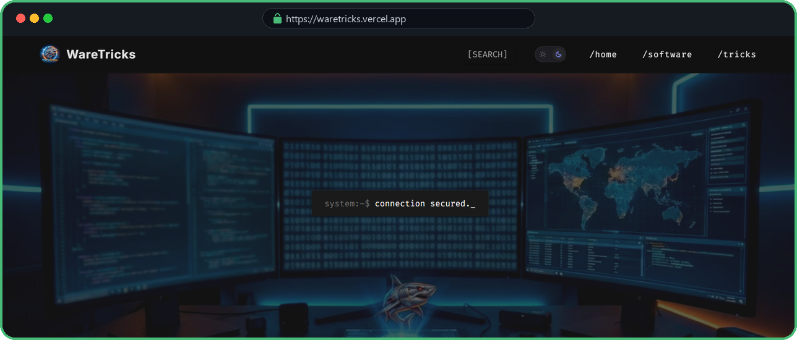
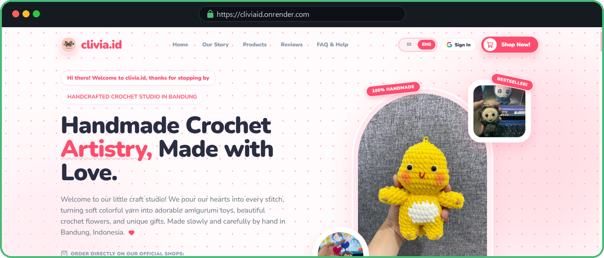

# ~$ whoami

  

---

## >_ About Me

SysAdmin by day, automation scripter by night. I keep servers, networks, and hardware running (both Linux and Windows), but my favorite part of the job is coding tools to automate the boring stuff. 

Lately, I've been writing PowerShell/Python scripts and building internal tools—like a custom IT asset management system—to cut down manual tasks. I use AI tools to speed up my coding so I can focus on building things that just work.

---

## >_ Open Source Project

  <a href="https://github.com/khairudinfahmi/WindowsPrinterSharingFix">
    <picture>
      <source media="(prefers-color-scheme: dark)" srcset="./assets/windows-printer-sharing-fix-dark.svg" />
      <source media="(prefers-color-scheme: light)" srcset="./assets/windows-printer-sharing-fix-light.svg" />
      
    </picture>
  </a>

---

## >_ IT Tools & Workarounds

  If you need essential software downloads, system utilities, or quick IT workarounds, you can visit my portal directly at <strong><a href="https://waretricks.vercel.app">WareTricks</a></strong>.

  <a href="https://waretricks.vercel.app">
    <picture>
      <source media="(prefers-color-scheme: dark)" srcset="./assets/waretricks_banner_final_dark.png" />
      <source media="(prefers-color-scheme: light)" srcset="./assets/waretricks_banner_final_light.png" />
      
    </picture>
  </a>

---

## >_ Creative Venture & E-Commerce

  Together with my partner, I also run <strong><a href="https://cliviaid.onrender.com">clivia.id</a></strong> — a handmade crochet studio based in Bandung crafting cute amigurumi dolls, flower bouquets, and aesthetic keychains. We built this custom web store and catalog to showcase our creations and handle customer orders.

  <a href="https://cliviaid.onrender.com">
    <picture>
      <source media="(prefers-color-scheme: dark)" srcset="./assets/cliviaid_banner_dark.png" />
      <source media="(prefers-color-scheme: light)" srcset="./assets/cliviaid_banner_light.png" />
      
    </picture>
  </a>

---

## >_ Tech Stack

<!-- TECH-STACK-LIST:START -->

  <a href="https://skillicons.dev">
    <picture>
      <source media="(prefers-color-scheme: dark)" srcset="https://skillicons.dev/icons?i=astro%2Ccss%2Cdocker%2Cgit%2Cgithub%2Chtml%2Cjs%2Claravel%2Clinux%2Cmysql%2Cnginx%2Cphp%2Cpowershell%2Cpython%2Cts%2Cvscode%2Cwindows&perline=8&theme=dark" />
      <source media="(prefers-color-scheme: light)" srcset="https://skillicons.dev/icons?i=astro%2Ccss%2Cdocker%2Cgit%2Cgithub%2Chtml%2Cjs%2Claravel%2Clinux%2Cmysql%2Cnginx%2Cphp%2Cpowershell%2Cpython%2Cts%2Cvscode%2Cwindows&perline=8&theme=light" />
      
    </picture>
  </a>

<!-- TECH-STACK-LIST:END -->

---

## >_ Stats

  <a href="https://github.com/khairudinfahmi">
    <picture>
      <source media="(prefers-color-scheme: dark)" srcset="./assets/github-stats-dark.svg" />
      <source media="(prefers-color-scheme: light)" srcset="./assets/github-stats-light.svg" />
      
    </picture>
  </a>

  <a href="https://github.com/khairudinfahmi">
    <picture>
      <source media="(prefers-color-scheme: dark)" srcset="./assets/github-streak-dark.svg" />
      <source media="(prefers-color-scheme: light)" srcset="./assets/github-streak-light.svg" />
      
    </picture>
  </a>

  <a href="https://github.com/khairudinfahmi">
    <picture>
      <source media="(prefers-color-scheme: dark)" srcset="./assets/top-languages-dark.svg" />
      <source media="(prefers-color-scheme: light)" srcset="./assets/top-languages-light.svg" />
      
    </picture>
  </a>

  

---

## >_ Latest Posts

<!-- BLOG-POST-LIST:START -->
- [WindowsPrinterSharingFix: Solusi Error Printer Sharing Windows &lpar;0x0000011b, 0x00000709, 0x00000bc4, dan error lainnya&rpar;](https://waretricks.vercel.app/software/windows-printer-sharing-fix-solusi-error-printer-sharing-windows-0x0000011b-0x00000709-0x00000bc4-dan-error-lainnya/)
- [Differences Between GPT and MBR Partitions on Hard Disks and SSDs](https://waretricks.vercel.app/tricks/differences-between-gpt-and-mbr-partitions-on-hard-disk-and-ssd/)
<!-- BLOG-POST-LIST:END -->